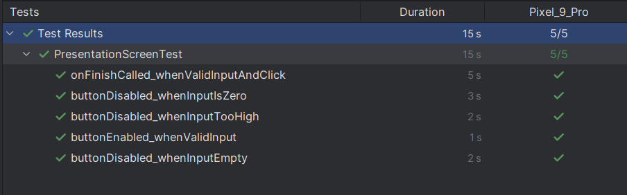
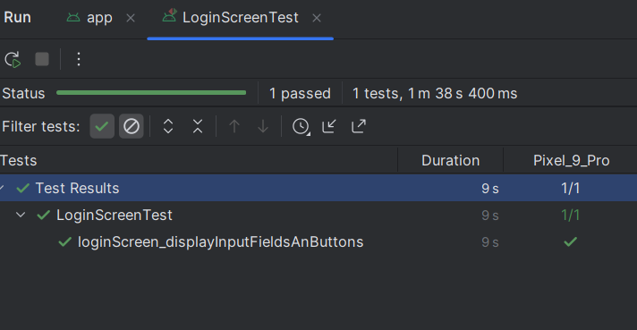
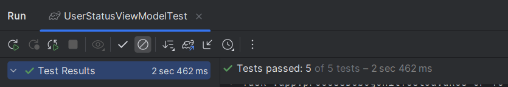

# Explicacion de los test aplicados

## Especificaciones 
los detalles del emulador usado es `Android 16 , API 36`
[Properties](documentation/emulator_properties.txt)

## SignInActivity
Para esta actividad no se le ha hecho pruebas unitarias por la complejidad de la logica.
Lo que pasa cuando intento hacer una prueba el emulador no logra conectarse correctamente con el servicio de google

Cabe resaltar que probando con el APK si se puede ejecutar lo cual es interesante

> Lineas futuras:
> Si hay disponibilidad y compatibilidad se hara test con appium

## Presentacion1Activity & PresentationScreenTest

En esta pantalla se define el numero de palabras que el usuario quiere aprender

Para esta actividad se ejecutan  pruebas que consiste en analizar el rendimientos de los valores de entrada

1. Botón deshabilitado si el campo está vacío.
2. Botón habilitado con entrada válida (por ejemplo, 10).
3. Botón deshabilitado si se ingresa un número mayor a 50.
4. Botón deshabilitado con 0.
5. Se llama a onFinish correctamente cuando la entrada es válida y se presiona el botón.

### Requisitos para que las pruebas funcionen
Agregar los identificadores al composable

```kotlin
import androidx.compose.ui.platform.testTag
// codigo programacion
OutlinedTextField(
    modifier = Modifier
        .testTag("input_npalabras")
)

Button(
    modifier = Modifier
        .width(120.dp)
        .testTag("btn_siguiente")
)

```

`testTag` es un identificador para que los tests puedan localizar elementos
específicos de forma confiable, incluso si el texto o contenido visual cambia.

Algunas modificaciones en el codigo fuente es el limite maximo de palabras al dia.
Si bien no debe ser tan limitado, pero la idea es no salir de la version free de firebase con las escrituras y lecturas
y tamebien para el APIKEY de openai

Razon por la que en `Presentation1Activity` modifico esta seccion de code:

```kotlin
// de esto 
enabled = !isLoading &&
        palabrasText.isNotEmpty() &&
        palabrasText.toIntOrNull() != null &&
        palabrasText.toInt() > 0

// a 
enabled = !isLoading &&
        palabrasText.isNotEmpty() &&
        palabrasText.toIntOrNull() != null &&
        // maximo de palabras 50
        palabrasText.toInt() in 1..50 

```
### Explicacion:
1. `@get:Rule val composeTestRule = createComposeRule()`
   Esta es la regla principal de testing para Jetpack Compose.
   Permite renderizar Composables en un entorno controlado de prueba y hacer assertions sobre su UI
2. `onNodeWithTag("input_npalabras")` y `onNodeWithTag("btn_siguiente")`
   Estas funciones buscan nodos (componentes de UI) usando su testTag
3. `composeTestRule.setContent { ... }`
   Aquí es donde se configura qué pantalla se va a probar.
4. `performTextInput("10")`
   Simula al usuario escribiendo texto dentro del OutlinedTextField.
   Es exactamente como si alguien escribiera 10 manualmente en el campo
5. `assertIsEnabled() `/ `assertIsNotEnabled()`
   Estas funciones validan si un componente está habilitado (clickeable) o no.
   Se usan para verificar que la lógica de validación del campo de entrada esté funcionando correctamente, según el número ingresado
6. `assertIsDisplayed()`
   Asegura que un componente existe y está visible en pantalla. Ideal para validar que el campo esté correctamente renderizado.
7. `performClick()`
   Simula un clic de usuario en un botón.
8. `var callbackInvokedWith: Int? = null` y lambda `onFinish = { callbackInvokedWith = it }
   Aquí no se usa un mock, sino una variable real que captura el valor enviado al callback `onFinish`.
   Esto reemplaza el uso de MockK y permite validar si el flujo del programa llegó correctamente a esa función:

    ```kotlin
   // la entrada fue 20
    assert(callbackInvokedWith == 20)
    
    ```

   Verifica que el botón realmente ejecutó el callback con el número correcto

### Output



## LoadingActivity & LoadingScreenTest
La `LoadingActivity` sirve como pantalla de entrada (splash lógica) para tu app. Su función es:

1. Verifica si el usuario está logueado con Firebase.
2. Si está logueado, consulta Firestore para ver si ya configuró su perfil.
3. Según los datos recibidos, redirige a:
   * 🟣 MainActivity: si el usuario ya configuró su número de palabras diario (maxPalabrasDia > 0).
   * 🟡 PresentationActivity: si aún no configuró el número de palabras.
   * 🔴 SignInActivity: si no hay sesión o ocurre un error.

En la imagen hacemos la simulacion de que se muestre el splash. Revisar code -> [LoadingScreenTest](app/src/androidTest/java/com/example/proyecto_movil_parcial/LoadingScreenTest.kt)



> No obstante para evaluar su correcto funcionamiento aislamos la logica con la interfaz para hacer pruebas unitarias

### Propuesta de aislamiento

Refactorizamos para testear `checkUserStatus()`. Esto implica separar la lógica de redirección/autenticación fuera de 
`Activity` y llevarla a un ViewModel para poder testearla unitariamente.

* Para ello la logica extraida la encontramos: `UserStatusViewModel.kt` – [ViewModel testable](app/src/main/java/com/example/proyecto_movil_parcial/viewmodel/UserStatusViewModel.kt)

#### Objetivo
* testear `UserStatusViewModel` de forma aislada.
* no se necesita lanzar la app ni usar dispositivos/emuladores
* simular respuestas de Firestore y FirebaseAuth.

Esta logica de pruebas la descargamos en la siguiente prueba `UserStatusViewModelTest`

### Dependencias

Se agregan las siguientes dependencias a nivel app en `build.gradle.kt`

```declarative
testImplementation("org.jetbrains.kotlinx:kotlinx-coroutines-test:1.7.3")
testImplementation("app.cash.turbine:turbine:1.0.0") // compatible con kotlinx.coroutines
// Revisar tener mockk
// testImplementation("io.mockk:mockk:1.13.10") 

// como usamos viewmodel es importante para que funcione StateFlow
implementation("androidx.lifecycle:lifecycle-viewmodel-ktx:2.6.2")

```

### Importacion de librerias o packetes 

Explicamos como y en donde ejecutamos las librerias dentro del codigo 

```kotlin
// capturar con slot<OnSuccessListener<DocumentSnapshot>> y llamarla con onSuccess(...)
import com.google.android.gms.tasks.OnSuccessListener

// Aplicamos un slot
val successSlot = slot<OnSuccessListener<DocumentSnapshot>>()

// Captura el listener y simula el éxito
every { docRef.addOnSuccessListener(capture(successSlot)) } answers {
   successSlot.captured.onSuccess(mockDocument)
   docRef
}

```

### UserStatusViewModelTest
#### Objetivo
Validar la lógica de negocio del UserStatusViewModel de forma aislada, sin requerir una ejecución real del backend ni Firebase.

#### Funciones
1. **user not logged in emits NotLoggedIn**
   * Cuando `FirebaseAuth.currentUser` es `null`, el ViewModel debe emitir `UserStatus.NotLoggedIn`
   * Asegura que tu app no intente seguir flujos protegidos sin autenticación.
2. **logged in but no document emits NeedsSetup**
   Si el usuario existe pero no hay un documento en Firestore, se emite `UserStatus.NeedsSetup`.
   Garantiza que la app redirija correctamente a la pantalla de configuración si el usuario no tiene datos guardados aún (como `maxPalabrasDia`).

3. **logged in with valid maxPalabrasDia emits Ready**
   * Valida el camino feliz del flujo: el usuario está autenticado y ya configurado correctamente.
   * La app debe llevarlo directo al inicio (`MainActivity`)
   * Si esta prueba falla, lleva al usuario ya configurado a la pantalla incorrecta.

4. **logged in with document missing maxPalabrasDia emits NeedsSetup**
   * Representa un caso muy real: el usuario se registró pero no completó el onboarding en el doc de firebase.
   * Si falla, el usuario queda "colgado" sin saber qué hacer, o la app puede fallar por intentar usar `null`
   
   | 🧾 Estado del usuario              | ¿Es válido? | ¿Qué pasa si no lo manejamos?                 |
   | ---------------------------------- | ----------- |-----------------------------------------------|
   | Autenticado pero sin Firestore doc | ❌           | La app no sabe qué hacer. Podría fallar.      |
   | Tiene doc pero falta campo clave   | ❌           | App podría crashear al usar `!!` sobre `null`. |
   | Tiene doc + campos válidos         | ✅           | Todo funciona normal                          |


5. **logged in but firestore fails emits Retry**
   * Simula una falla en Firestore (sin internet, error interno, etc.)
   * Verifica que el ViewModel reacciona con un estado de reintento o notificación, en lugar de crashear. Mejora la resiliencia del app

#### Output

El resultado esperado es que se pueda pasar las 5 pruebas y asi fue!

